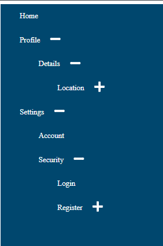

## Recursively calling MenuList component within the MenuItem component

### checking the rendering of the children of each object of the 'menus' list


```javascript
import MenuItem from "./MenuItem";

export default function MenuList({ menus =[]}) {
  return (
    <ul className="menu-list-container">
      { menus && menus.length ? menus.map((listItem,index) => <MenuItem key={index} item={listItem} />) : null
    }
    </ul>
  );
}

```

```javascript
import MenuList from "./MenuList";
export default function MenuItem({ item }) {
  

  return (
      <li>
        <p>
        {item.label}
        </p>
        {item && item.children && item.children.length ? 
          <MenuList menus={item.children} />
        : null}
      </li>
  );
}

```


----
