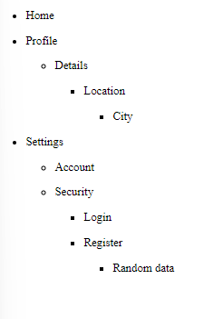

## Recursively calling MenuList component within the MenuItem component

### checking the rendering of the children of each object of the 'menus' list


```javascript
import MenuItem from "./MenuItem";

export default function MenuList({ menus =[]}) {
  return (
    <ul className="menu-list-container">
      { menus && menus.length ? menus.map((listItem,index) => <MenuItem key={index} item={listItem} />) : null
    }
    </ul>
  );
}

```

```javascript
import MenuList from "./MenuList";
export default function MenuItem({ item }) {
  

  return (
      <li>
        <p>
        {item.label}
        </p>
        {item && item.children && item.children.length ? 
          <MenuList menus={item.children} />
        : null}
      </li>
  );
}

```


----
## Overall code explanation

1. Imports:
   The code starts with necessary imports:

   ```jsx
   import { useState } from "react";
   import MenuList from "./menu-list";
   import {FaMinus, FaPlus} from 'react-icons/fa'
   ```

   This imports the useState hook from React, a MenuList component (likely for rendering nested items), and icons for the toggle button.

2. MenuItem Component:
   The main component is defined as:

   ```jsx
   export default function MenuItem({ item }) {
     // ... component logic
   }
   ```

3. State Management:
   The component uses useState to manage which children are displayed:

   ```jsx
   const [displayCurrentChildren, setDisplayCurrentChildren] = useState({});
   ```

4. handleToggleChildren Function:
   This function toggles the visibility of child items:

   ```jsx
   function handleToggleChildren(getCurrentlabel) {
     setDisplayCurrentChildren({
       ...displayCurrentChildren,
       [getCurrentlabel]: !displayCurrentChildren[getCurrentlabel],
     });
   }
   ```

5. Render:
   The component's return statement structures the menu item:

   ```jsx
   return (
     <li>
       <div className="menu-item">
         <p>{item.label}</p>
         {item && item.children && item.children.length ? (
           <span onClick={() => handleToggleChildren(item.label)}>
             {
               displayCurrentChildren[item.label] ? <FaMinus color="#fff" size={25} /> : <FaPlus color="#fff" size={25} />
             }
           </span>
         ) : null}
       </div>
       {item && item.children && item.children.length > 0 && displayCurrentChildren[item.label] ? (
         <MenuList list={item.children} />
       ) : null}
     </li>
   );
   ```

   This renders the item's label, a toggle button if the item has children, and a nested MenuList if children exist and are set to be displayed.

6. Conditional Rendering:
   The code uses ternary operators and logical AND (&&) for conditional rendering:

   ```jsx
   {item && item.children && item.children.length ? (
     // render toggle button
   ) : null}

   {item && item.children && item.children.length > 0 && displayCurrentChildren[item.label] ? (
     <MenuList list={item.children} />
   ) : null}
   ```

   These ensure that the toggle button and nested MenuList only appear when appropriate.

This component creates an interactive menu item that can expand to show nested items, using React hooks for state management and conditional rendering for a dynamic user interface.
